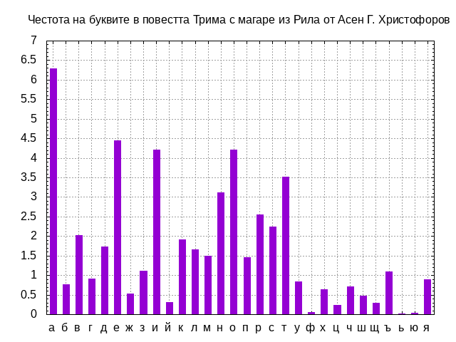

## Честотен анализ на буквите в два литературни текста на български език

#### Източници:

* [Под игото, Иван Вазов](https://chitanka.info/book/1773-pod-igoto)
* [Трима с магаре из Рила, Асен Г. Христофоров](https://chitanka.info/book/4233-trima-s-magare-iz-rila)

#### Методика

Текстовете на двете литературни прозиведения са свалени от сайта [Читанка](https://chitanka.info) в
plain text формат. 

Текстовете са обработени както следва:
 
1. Премахнати са всички пунктуационни знаци: <pre>sed 's/[[:punct:]]//g'</pre>
1. Премахнати са всички цифри: <pre>sed 's/[[:num:]]//g'</pre>
1. Премахнати са всички интервали: <pre>sed 's/ //g'</pre>
1. Премахнати са всички табулации: <pre>sed 's/\t//g'</pre>
1. Премахнати са всички нови редове CR+LF: <pre>sed 's/\^M//g'</pre>
2. Премахнати са всички нови редове: <pre>sed 's/\n//g'</pre>
3. Главните букви в текстовете са превърнати в редови: <pre>awk '{print tolower($0)}'</pre>   

*Забележка:* Тъй като в текстовете вместо __ѝ__ е използвана буквата __й__ между стъпка 2 и стъпка 3
преброени всички срещания на __й__ между два интрвала (*grep -c " й "*). Сумата е извадена от
общия резултат на __й__ и добавена в общия резултат на __и__ в резултата от общото преброяване на буквите по-късно.   

Общия брой на буквите в текста е изчислен така: <pre>wc -c text_p</pre>
Броя на всяка буква в текстовете е преброен, след което е изчислен в процент от общия брой букви в
съответния текст: <pre>grep -o . text_p | uniq -c | sort -k2 | awk '{c = ($1/1155525)*100; printf "%s %s %.2f\n",$1,$2,c }'</pre>
Нанесена е корекцията за __ѝ__ и __и__ (виж забележката по-горе).   
С помощта на __gnuplot__ са изчертани графики от резлутатите, използван е скрипта [plot](./plots/plot)

