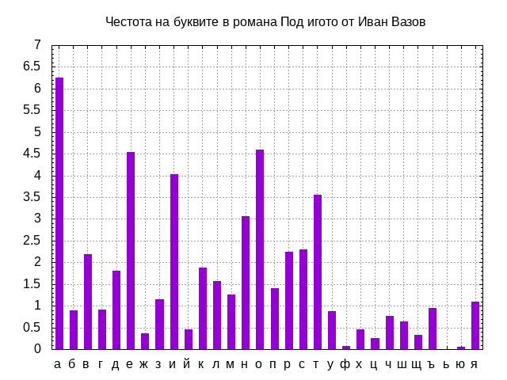

## Честотен анализ на буквите в българския език

### Предистория

#### Ранни опити
  

#### Източници:

* [Хигиенно-ергономична оценка на компютърните клавиатурни подредби, Б. Стефанов и В. Бирданова, сп. "Computer", 1997, 2, 56-62](http://web.archive.org/web/20061013135120/http://www.eunet.bg/media/show_story.html?issue=38874639&media=38874542&class=38874766&story=89202066)

